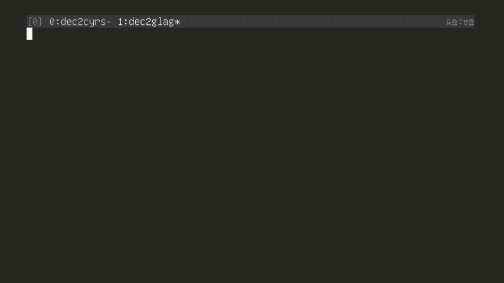

This script converts decimal numbers to Glagolitic numerals. It includes an option to add a titlo symbol to the result. 

## Features 

- Convert decimal numbers to Glagolitic numerals
- Optional titlo symbol addition
- Command-line interface
- Can be used as a Python module 

## Requirements 

- Python 3.x
- Bash 

## Installation 

### As a script 

1. Clone this repository:

`git clone https://github.com/slojinika/dec2glag.git` 

2. Navigate to the project directory: 

`cd dec2glag` 

## Usage 

### As a script 

Run the script from the command line: 

python dec2glag.py [-h] [-t] number 

Arguments:
- number: The decimal number to convert (required)
- -t, --titlo: Add titlo to the result (optional)
- -h, --help: Show help message and exit 

### As a module 

```from dec2glag import dec2glag 

# Convert 220 to Glagolitic
result = dec2glag(220)
print(result)` 

# Convert 888 with titlo
result_with_titlo = dec2glag(888, use_titlo=True)
print(result_with_titlo)
``` 

## Examples 

1. Convert 220 to Glagolitic
   
`python dec2glag.py 220` 

2. Convert 220 with titlo:

`python dec2glag.py -t 220` 

## ⰹ or ⰺ?
I have met the opinion that ⰹ this symbol has never been used as a denotation of a digit, although I have seen live examples when it was used. I took as a basis the normative variant (ⰺ) from the Marian Gospel (Cod. Slav. 146). If I am wrong, please correct it. 
| | | | | | | | | |
|:-:|:-:|:-:|:-:|:-:|:-:|:-:|:-:|:-:|
| ⱍ (1000) | ⱎ (2000)| ⱏ (3000)| ⱑ (4000)| ⱓ (5000)|
| ⱃ (100) | ⱄ (200) | ⱅ (300) | ⱆ (400) | ⱇ (500) | ⱈ (600) | ⱉ (700) | ⱋ (800) | ⱌ (900) | |
| ⰺ (10) | ⰻ (20) | ⰼ (30) | ⰽ (40) | ⰾ (50) | ⰿ (60) | ⱀ (70) | ⱁ (80) | ⱂ (90) | |
| ⰰ (1) | ⰱ (2) | ⰲ (3) | ⰳ (4) | ⰴ (5) | ⰵ (6) | ⰶ (7) | ⰷ (8) | ⰸ (9) | |
